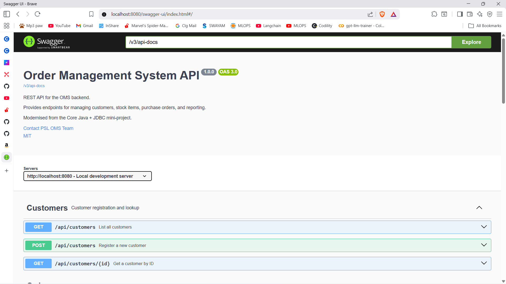
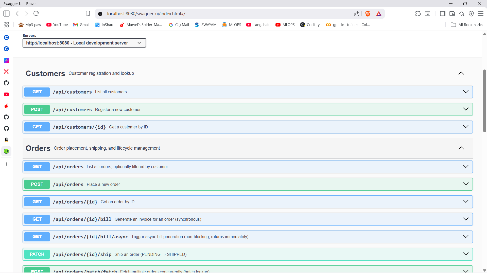
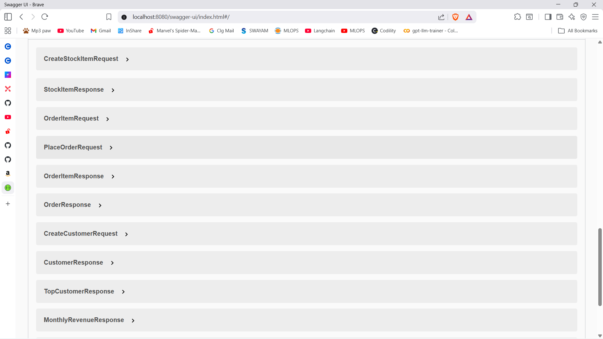
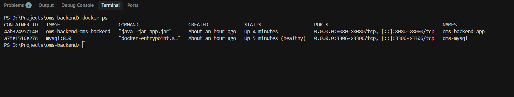

# Concurrent Order Management System

A backend REST API for managing orders, customers, and inventory — built with Java 17 and Spring Boot 3. The project covers the full order lifecycle, async processing, Concurrent order processing, and scheduled background jobs, all running in Docker with a MySQL database.

---

## Features

- Place and track orders with transactional stock validation
- Ship orders and generate invoices (sync and async)
- Customer and inventory management
- Async bill generation using `@Async` and `CompletableFuture`
- Concurrent batch order processing via `ExecutorService`
- Scheduled nightly scan for delayed orders (`@Scheduled`)
- Reporting endpoints — monthly revenue, order counts, top customer
- Flyway-managed database migrations (no manual SQL setup)
- Swagger UI for easy API exploration

---

## Tech Stack

| | |
|---|---|
| Language | Java 17 |
| Framework | Spring Boot 3 |
| Database | MySQL 8.0 |
| ORM | Spring Data JPA / Hibernate |
| Migrations | Flyway |
| Async | `CompletableFuture`, `ExecutorService`, `@Async`, `@Scheduled` |
| Docs | Springdoc OpenAPI / Swagger UI |
| Container | Docker, Docker Compose |
| Build | Maven |

---

## Screenshots

### Swagger UI Home



### API Endpoints



### Request / Response Schemas



### Docker Containers Running



`http://localhost:8080/swagger-ui/index.html`

---

## API Overview

### Orders `/api/orders`

| Method | Endpoint | Description |
|---|---|---|
| `POST` | `/api/orders` | Place a new order |
| `GET` | `/api/orders` | List all orders (filter by `?customerId=`) |
| `GET` | `/api/orders/{id}` | Get a single order |
| `PATCH` | `/api/orders/{id}/ship` | Ship an order |
| `GET` | `/api/orders/delayed` | List orders past their ship deadline |
| `GET` | `/api/orders/{id}/bill` | Get invoice (synchronous) |
| `GET` | `/api/orders/{id}/bill/async` | Trigger async invoice generation (returns 202) |
| `POST` | `/api/orders/batch/fetch` | Fetch multiple orders concurrently |

### Customers `/api/customers`

| Method | Endpoint | Description |
|---|---|---|
| `POST` | `/api/customers` | Register a customer |
| `GET` | `/api/customers` | List all customers |
| `GET` | `/api/customers/{id}` | Get customer by ID |

### Inventory `/api/stock-items`

| Method | Endpoint | Description |
|---|---|---|
| `POST` | `/api/stock-items` | Add a stock item |
| `GET` | `/api/stock-items` | List all stock items |
| `GET` | `/api/stock-items/{id}` | Get item by ID |

### Reports `/api/reports`

| Method | Endpoint | Description |
|---|---|---|
| `GET` | `/api/reports/monthly-orders` | Shipped order counts by month |
| `GET` | `/api/reports/monthly-revenue` | Revenue from shipped orders by month |
| `GET` | `/api/reports/top-customer` | Customer with the most orders |

---

## Running with Docker

**Prerequisites:** Docker Desktop installed. That's it — no local Java or MySQL needed.

**1. Clone the repo and create a `.env` file in the project root:**

```env
MYSQL_DATABASE=order-management_db
MYSQL_ROOT_PASSWORD=rootpassword
MYSQL_USER=omsuser
MYSQL_PASSWORD=omspassword

SPRING_DATASOURCE_URL=jdbc:mysql://mysql:3306/order-management_db?useSSL=false&serverTimezone=UTC&allowPublicKeyRetrieval=true
SPRING_DATASOURCE_USERNAME=omsuser
SPRING_DATASOURCE_PASSWORD=omspassword
```

**2. Build and start:**

```bash
mvn clean package -DskipTests
docker compose up --build -d
```

The app waits for MySQL to be healthy before starting. Flyway sets up the schema automatically on first boot.

**3. Open Swagger UI:** `http://localhost:8080/swagger-ui/index.html`

**4. Stop:**

```bash
docker compose down        # keeps data
docker compose down -v     # wipes data
```

---

## Running Locally (without Docker)

**Prerequisites:** Java 17, Maven, MySQL 8.0

```bash
# Create DB and user in MySQL
CREATE DATABASE `order-management_db`;
CREATE USER 'omsuser'@'localhost' IDENTIFIED BY 'omspassword';
GRANT ALL PRIVILEGES ON `order-management_db`.* TO 'omsuser'@'localhost';

# Set env vars then run
export DB_USERNAME=omsuser
export DB_PASSWORD=omspassword
mvn spring-boot:run -Dspring-boot.run.profiles=dev
```

---

## Project Structure

```
src/main/java/com/psl/oms/
├── async/          # BillGeneratorService, ConcurrentOrderProcessor, DelayedOrderScheduler
├── config/         # AsyncConfig (thread pools), OpenApiConfig
├── controller/     # REST controllers
├── dto/            # Request and response DTOs
├── entity/         # JPA entities
├── exception/      # GlobalExceptionHandler + custom exceptions
├── repository/     # Spring Data JPA repositories
└── service/        # Business logic
```

---

## Concurrency Overview

Three patterns are used across the project:

- **`@Async` + `CompletableFuture`** — async bill generation runs on a background thread pool. The HTTP response returns immediately with `202 Accepted` while the invoice is assembled in the background.
- **`ExecutorService`** — batch order fetching submits each lookup as a separate task to a fixed thread pool and collects all results when they complete.
- **`@Scheduled`** — a cron job runs at midnight daily and logs any orders still `PENDING` past their ship date.

Two named thread pools are configured in `AsyncConfig` — one for `@Async` tasks and one for the `ExecutorService` processor — so each concern has its own pool.

---

## Future Improvements

- Add pagination to list endpoints
- Polling endpoint to check async bill status
- `V2__seed_data.sql` for quick local testing
- Integration tests with Testcontainers
- JWT-based authentication